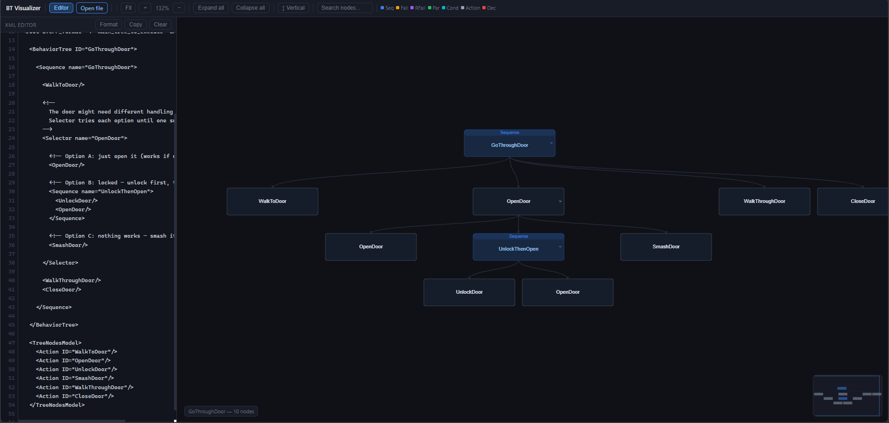

# BT Visualizer

**Live demo → [iameijaz.github.io/bt-viz](https://iameijaz.github.io/bt-viz)**

A lightweight, browser-based visualizer for [BehaviorTree.CPP](https://www.behaviortree.dev/) format 4 XML files.
No installation. No server. No dependencies. Open the link and go.


---

## What it does

Paste or open any BehaviorTree.CPP `.xml` file and get an interactive
tree diagram — pan, zoom, drag nodes, collapse subtrees, live XML editor,
vertical / horizontal layout toggle, minimap, and node search.

The classic door example loads on startup so you can see it working immediately.



---

## Usage

**Option 1 — use the hosted version (no setup):**

👉 **[iameijaz.github.io/bt-visualizer](https://iameijaz.github.io/bt-visualizer)**

**Option 2 — run locally:**
```bash
# No build step needed — just open the file
open index.html        # macOS
xdg-open index.html    # Linux
start index.html       # Windows
```

**Option 3 — load your BT XML:**
- Drag and drop a `.xml` file onto the canvas
- Click **Open file** in the toolbar
- Paste XML into the editor pane — tree updates as you type

---

## Features

### Canvas
| Action | How |
|--------|-----|
| Pan | Click and drag on empty canvas |
| Zoom | Scroll wheel (7% → 350%) |
| Move a node | Click and drag the node |
| Collapse / expand subtree | Double-click any control node |
| Node details | Hover — shows type, ports, attributes |
| Select + jump to source | Click a node → editor scrolls to that line |

### Toolbar
| Control | What it does |
|---------|-------------|
| **Editor** | Show / hide the XML editor pane |
| **Open file** | Load a `.xml` file from disk |
| **Fit** | Reset view to show the whole tree |
| **+ / −** | Zoom in / out |
| **Expand / Collapse all** | Toggle all subtrees |
| **↕ / ↔** | Switch between vertical and horizontal layout |
| **Search** | Jump to and highlight matching nodes |

### Node colours
| Colour | Node type |
|--------|-----------|
| 🔵 Blue | Sequence |
| 🟡 Amber | Fallback / Selector |
| 🟣 Purple | ReactiveFallback |
| 🟢 Green | Parallel |
| 🩵 Cyan | Condition |
| ⚪ Gray | Action |
| 🔴 Red | Decorator |

---

## XML format

Standard BehaviorTree.CPP format 4. The `TreeNodesModel` section is optional
but recommended — it tells the visualizer whether custom nodes are Actions,
Conditions, or Decorators so they get the right colour.

```xml
<?xml version="1.0" encoding="UTF-8"?>
<root BTCPP_format="4" main_tree_to_execute="MyTree">

  <BehaviorTree ID="MyTree">
    <Sequence name="Root">
      <MyCondition/>
      <MyAction/>
    </Sequence>
  </BehaviorTree>

  <TreeNodesModel>
    <Condition ID="MyCondition"/>
    <Action    ID="MyAction"/>
  </TreeNodesModel>

</root>
```

Multiple `BehaviorTree` elements in one file are supported — a dropdown
appears in the toolbar to switch between them.

---

## Technical notes

Single HTML file — ~700 lines, zero external dependencies, zero build step.
Rendering uses the HTML5 Canvas 2D API. Layout uses a recursive
Reingold–Tilford style algorithm. XML parsing uses the browser's built-in
`DOMParser`. Tested comfortably with trees of ~200 nodes on low-spec hardware.

---

## Roadmap

- [ ] Simulation mode — toggle node states (SUCCESS / FAILURE / RUNNING), watch the tree tick
- [ ] Export canvas to PNG
- [ ] Subtree inline expansion
- [ ] Syntax highlighting in the editor

---

## Related

This tool was built alongside [`ros2-bt-demo`](https://github.com/iameijaz/ros2-bt-demo) —
a ROS2 patrol robot implementation using BehaviorTree.CPP and Nav2.

---

## License

MIT — do whatever you want with it.
